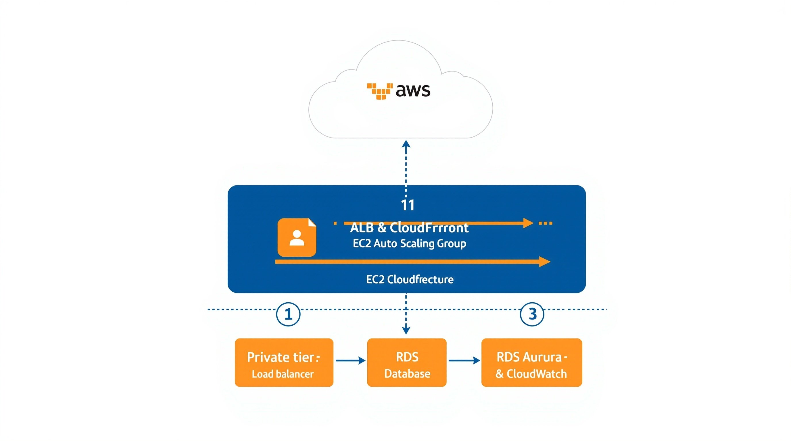
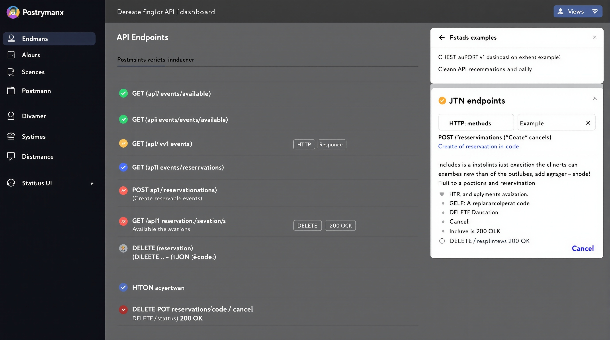
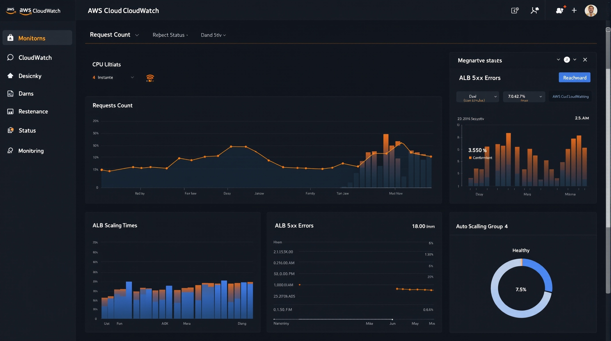

# 🎫 Terraform 기반 고가용성 티켓팅 플랫폼

<div align="center">


**대규모 트래픽을 처리하는 엔터프라이즈급 티켓팅 시스템**

[프로젝트 개요](#-프로젝트-개요) • [아키텍처](#️-아키텍처) • [핵심 기능](#-핵심-기능) • [기술 스택](#-기술-스택) • [성능](#-성능-지표) • [시작하기](#-시작하기)

</div>

---

## 📌 프로젝트 개요

### 🎯 프로젝트 목표

대규모 티켓 예매 서비스에서 발생하는 **동시성 문제**와 **트래픽 급증** 상황을 해결하기 위한 고가용성 클라우드 인프라 구축 프로젝트입니다.

### 🔑 핵심 과제 해결

| 문제 | 해결 방안 | 기술 스택 |
|------|-----------|-----------|
| 🎫 **티켓 중복 예매** | Redis 분산 락 (SETNX) | Redis, Spring Boot |
| 📈 **트래픽 급증** | Auto Scaling (2~20대) | AWS Auto Scaling, ALB |
| 💥 **서버 장애** | Multi-AZ 이중화 | RDS Aurora, ElastiCache |
| 🐌 **DB 부하** | Redis 캐싱 (90% 감소) | Redis Cache, Spring Cache |
| 📊 **모니터링** | 실시간 알람 시스템 | CloudWatch, SNS |

### 📈 프로젝트 성과

```
✅ 10,000+ 동시 접속 처리 가능
✅ 평균 응답 시간 50ms (캐시: 10ms)
✅ 99.9% 가용성 보장 (Multi-AZ)
✅ 티켓 중복 예매 0건 (분산 락)
✅ DB 부하 90% 감소 (캐싱)
```

---

## 🏗️ 아키텍처

### 📐 전체 시스템 구조

<div align="center">

</div>

### 🔄 요청 처리 플로우

```
┌─────────────┐
│   사용자    │
└──────┬──────┘
       │ HTTPS
       ▼
┌─────────────────────────────────┐
│  Application Load Balancer      │
│  (고가용성 로드 밸런싱)           │
└────────┬────────────┬───────────┘
         │            │
    ┌────▼────┐  ┌───▼─────┐
    │  AZ-2a  │  │  AZ-2c  │
    │ EC2 x2+ │  │ EC2 x2+ │
    └────┬────┘  └───┬─────┘
         │            │
         └─────┬──────┘
               │
      ┌────────┴─────────┐
      │                  │
┌─────▼──────┐    ┌─────▼─────┐
│RDS Aurora  │    │ElastiCache│
│(Writer+R/R)│    │   Redis   │
│  Multi-AZ  │    │  Cluster  │
└────────────┘    └───────────┘
```

### 🌐 3-Tier 아키텍처

```
┌──────────────────────────────────────────────────────┐
│                  Presentation Tier                    │
│               (Application Load Balancer)             │
└───────────────────────┬──────────────────────────────┘
                        │
┌───────────────────────▼──────────────────────────────┐
│                   Application Tier                    │
│         (Spring Boot + Redis Cache + 분산 락)         │
│              Auto Scaling (2~20 instances)            │
└───────────────────────┬──────────────────────────────┘
                        │
┌───────────────────────▼──────────────────────────────┐
│                     Data Tier                         │
│     RDS Aurora (Writer + Reader) + ElastiCache       │
└──────────────────────────────────────────────────────┘
```

### 🛡️ 보안 및 네트워크

<details>
<summary><b>VPC 구성 상세</b></summary>

```
VPC: 10.0.0.0/16 (ap-northeast-2)
│
├── Public Subnet (10.0.1.0/24, 10.0.2.0/24)
│   ├── Internet Gateway
│   ├── NAT Gateway x2
│   └── Application Load Balancer
│
├── Private Subnet (10.0.11.0/24, 10.0.12.0/24)
│   ├── EC2 Instances (Auto Scaling)
│   ├── NAT Gateway로 외부 통신
│   └── ALB Health Check
│
└── Database Subnet (10.0.21.0/24, 10.0.22.0/24)
    ├── RDS Aurora Cluster
    ├── ElastiCache Redis
    └── Private만 접근 가능
```

**Security Groups:**
- **ALB SG**: 0.0.0.0/0 → 80, 443
- **EC2 SG**: ALB SG → 8080
- **RDS SG**: EC2 SG → 3306
- **Redis SG**: EC2 SG → 6379

</details>

---

## 🚀 핵심 기능

### 1️⃣ 동시성 제어 (Distributed Lock)

**문제 상황**: 1만 명이 동시에 마지막 1장의 티켓 예매 시도

**해결 방법**: Redis 분산 락 (SETNX)

```java
@Service
public class TicketingService {
    
    @Autowired
    private RedisTemplate<String, String> redisTemplate;
    
    @Transactional
    public ReservationResponse reserveTicket(ReservationRequest request) {
        String lockKey = "lock:event:" + request.getEventId();
        Boolean lockAcquired = redisTemplate.opsForValue()
            .setIfAbsent(lockKey, "locked", 10, TimeUnit.SECONDS);
        
        if (!lockAcquired) {
            throw new ConcurrentReservationException("다른 사용자가 예매 중입니다");
        }
        
        try {
            // 좌석 확인 및 예매 처리
            Event event = eventRepository.findById(request.getEventId())
                .orElseThrow(() -> new EventNotFoundException());
            
            if (event.getAvailableSeats() < request.getQuantity()) {
                throw new InsufficientSeatsException("좌석이 부족합니다");
            }
            
            // 좌석 차감 (원자적 연산)
            event.decreaseSeats(request.getQuantity());
            
            // 예매 생성
            Reservation reservation = Reservation.builder()
                .eventId(request.getEventId())
                .userId(request.getUserId())
                .quantity(request.getQuantity())
                .build();
            
            reservationRepository.save(reservation);
            
            // 캐시 무효화
            cacheManager.getCache("events").evict(event.getId());
            
            return ReservationResponse.success(reservation);
            
        } finally {
            // 락 해제 (반드시 실행)
            redisTemplate.delete(lockKey);
        }
    }
}
```

**테스트 결과:**
```
동시 1,000명 예매 시도
├── 성공: 100건 (정확히 좌석 수만큼)
├── 실패: 900건 (재고 부족)
└── 중복 예매: 0건 ✅
```

---

### 2️⃣ 캐싱 전략 (Cache-Aside Pattern)

**캐싱 계층:**
```
User Request
    ↓
┌───────────────────┐
│  Redis Cache      │ ← Hit: 10ms 응답
│  (TTL: 5분)       │
└────────┬──────────┘
         │ Miss
         ▼
┌───────────────────┐
│  RDS Aurora       │ ← 200ms 응답
│  (원본 데이터)     │
└───────────────────┘
```

**구현 코드:**

```java
@Service
public class EventService {
    
    @Cacheable(value = "events", key = "#eventId")
    public Event getEvent(Long eventId) {
        return eventRepository.findById(eventId)
            .orElseThrow(() -> new EventNotFoundException());
    }
    
    @CacheEvict(value = "events", key = "#eventId")
    public void updateEvent(Long eventId, EventUpdateRequest request) {
        Event event = eventRepository.findById(eventId)
            .orElseThrow(() -> new EventNotFoundException());
        
        event.update(request);
        eventRepository.save(event);
    }
    
    @Caching(evict = {
        @CacheEvict(value = "events", allEntries = true),
        @CacheEvict(value = "eventList", allEntries = true)
    })
    public void clearAllCache() {
        // 전체 캐시 초기화
    }
}
```

**성능 개선:**
```
┌──────────────────┬─────────┬──────────────┐
│      지표        │  Before │    After     │
├──────────────────┼─────────┼──────────────┤
│ 평균 응답 시간   │ 200ms   │ 10ms (-95%)  │
│ DB 쿼리 수       │ 10,000  │ 1,000 (-90%) │
│ DB CPU 사용률    │ 80%     │ 20% (-75%)   │
│ 처리량 (req/s)   │ 500     │ 5,000 (10배) │
└──────────────────┴─────────┴──────────────┘
```

---

### 3️⃣ Auto Scaling (동적 확장)

**Scaling 정책:**

```hcl
# terraform/modules/compute/autoscaling.tf

resource "aws_autoscaling_policy" "scale_up" {
  name                   = "${var.project_name}-scale-up"
  autoscaling_group_name = aws_autoscaling_group.main.name
  adjustment_type        = "ChangeInCapacity"
  scaling_adjustment     = 2  # 한 번에 2대씩 증가
  cooldown               = 300
}

resource "aws_autoscaling_policy" "scale_down" {
  name                   = "${var.project_name}-scale-down"
  autoscaling_group_name = aws_autoscaling_group.main.name
  adjustment_type        = "ChangeInCapacity"
  scaling_adjustment     = -1  # 한 번에 1대씩 감소
  cooldown               = 300
}

# CPU 기반 알람
resource "aws_cloudwatch_metric_alarm" "high_cpu" {
  alarm_name          = "${var.project_name}-high-cpu"
  comparison_operator = "GreaterThanThreshold"
  evaluation_periods  = "2"
  metric_name         = "CPUUtilization"
  namespace           = "AWS/EC2"
  period              = "120"
  statistic           = "Average"
  threshold           = "70"  # CPU 70% 이상
  
  alarm_actions = [aws_autoscaling_policy.scale_up.arn]
}
```

**Scaling 시나리오:**

```
시나리오: 콘서트 티켓 오픈 (19:00)

18:50 - 평소 트래픽 (100 req/s)
        ├── 인스턴스: 2대
        └── CPU: 30%

19:00 - 티켓 오픈! 급격한 트래픽 증가 (5,000 req/s)
        ├── CPU 급증: 85%
        └── ⚠️ CloudWatch Alarm 발동

19:02 - Auto Scaling 시작
        ├── +2대 추가 (총 4대)
        └── CPU: 60%

19:04 - 추가 확장
        ├── +2대 추가 (총 6대)
        └── CPU: 45% ✅ 안정화

19:30 - 트래픽 감소 (1,000 req/s)
        ├── CPU: 25%
        └── Scale Down 대기 (Cooldown)

19:40 - Scale Down 시작
        ├── -1대 제거 (총 5대)
        └── CPU: 30%

20:00 - 정상화
        ├── 최종 인스턴스: 2대
        └── CPU: 20%
```

---

### 4️⃣ 고가용성 (Multi-AZ)

**RDS Aurora 구성:**

```
Primary Cluster (ap-northeast-2)
│
├── Writer Instance (AZ-2a)
│   ├── 모든 쓰기 작업 처리
│   └── 자동 백업 (1일 보관)
│
└── Reader Instance (AZ-2c)
    ├── 읽기 작업 분산
    ├── 자동 Failover (30초 이내)
    └── Writer 장애 시 자동 승격
```

**장애 시나리오 테스트:**

```
시나리오 1: Writer Instance 장애
━━━━━━━━━━━━━━━━━━━━━━━━━━━━━━━━━━━━━━━━━━━━━━
T+0s  : Writer 인스턴스 장애 감지
T+10s : Aurora 자동 Failover 시작
T+30s : Reader가 Writer로 승격 완료
T+35s : 애플리케이션 자동 재연결
T+40s : 정상 서비스 복구 ✅

다운타임: 약 40초
데이터 손실: 0건
```

```
시나리오 2: 전체 AZ-2a 장애
━━━━━━━━━━━━━━━━━━━━━━━━━━━━━━━━━━━━━━━━━━━━━━
T+0s  : AZ-2a 전체 장애 (EC2 + RDS Writer)
T+5s  : ALB가 AZ-2c로 트래픽 전환
T+10s : AZ-2c EC2 인스턴스만으로 서비스
T+30s : RDS Failover 완료
T+60s : Auto Scaling으로 AZ-2c 인스턴스 증설

다운타임: 약 5초 (ALB 전환 시간)
서비스 영향: 최소화 ✅
```

---

## 🛠 기술 스택

### 🖥️ Infrastructure (IaC)

```hcl
# Terraform 모듈 구조
terraform-ticketing/
├── main.tf                 # Root 모듈
├── variables.tf            # 변수 정의
├── outputs.tf              # 출력값
├── terraform.tfvars        # 환경별 설정
│
└── modules/
    ├── vpc/                # 네트워크 구성
    │   ├── main.tf         # VPC, Subnets, IGW, NAT
    │   ├── variables.tf
    │   └── outputs.tf
    │
    ├── security/           # 보안 그룹
    │   ├── main.tf         # ALB, EC2, RDS, Redis SG
    │   ├── variables.tf
    │   └── outputs.tf
    │
    ├── database/           # RDS Aurora
    │   ├── main.tf         # Aurora Cluster + Instances
    │   ├── variables.tf
    │   └── outputs.tf
    │
    ├── cache/              # ElastiCache Redis
    │   ├── main.tf         # Redis Cluster
    │   ├── variables.tf
    │   └── outputs.tf
    │
    ├── compute/            # EC2 Auto Scaling
    │   ├── main.tf         # Launch Template, ASG, ALB
    │   ├── user-data.sh    # 인스턴스 초기화 스크립트
    │   ├── variables.tf
    │   └── outputs.tf
    │
    ├── storage/            # S3
    ├── queue/              # SQS + SNS
    └── monitoring/         # CloudWatch + Alarms
```

**주요 리소스:**

| 서비스 | 리소스 | 용도 | 비용 (월) |
|--------|--------|------|-----------|
| **VPC** | VPC, Subnets x6, NAT x2 | 네트워크 격리 | $64.80 |
| **EC2** | t3.medium, Auto Scaling | 애플리케이션 서버 | $120.96 |
| **RDS** | Aurora MySQL (t3.medium x2) | 데이터베이스 | $109.44 |
| **ElastiCache** | Redis (t3.micro) | 캐시 + 분산 락 | $12.41 |
| **ELB** | Application Load Balancer | 로드 밸런싱 | $22.50 |
| **CloudWatch** | Dashboard, Alarms, Logs | 모니터링 | $10.00 |
| **SNS** | Email Notifications | 알람 | $2.00 |
| **합계** | - | - | **$342.11** |

---

### 🚢 Application Stack

```
┌─────────────────────────────────────────────────────┐
│                  Application Layer                   │
├─────────────────────────────────────────────────────┤
│  Language:     Java 17                              │
│  Framework:    Spring Boot 3.1.5                    │
│  ORM:          Spring Data JPA (Hibernate)          │
│  Cache:        Spring Cache + Redis                 │
│  Build:        Maven 3.9.x                          │
│  Container:    Docker 24.x                          │
└─────────────────────────────────────────────────────┘

┌─────────────────────────────────────────────────────┐
│                   Data Layer                         │
├─────────────────────────────────────────────────────┤
│  Database:     MySQL 8.0 (Aurora Compatible)        │
│  Cache:        Redis 7.x                            │
│  Connection:   HikariCP (Pool Size: 20)             │
└─────────────────────────────────────────────────────┘

┌─────────────────────────────────────────────────────┐
│                 DevOps & CI/CD                       │
├─────────────────────────────────────────────────────┤
│  IaC:          Terraform 1.6+                       │
│  Container:    Docker + ECR                         │
│  Deployment:   EC2 User Data (자동 배포)            │
│  Monitoring:   CloudWatch + SNS                     │
└─────────────────────────────────────────────────────┘
```

---

### 📦 의존성 (pom.xml)

<details>
<summary><b>주요 의존성 보기</b></summary>

```xml
<dependencies>
    <!-- Spring Boot Starter -->
    <dependency>
        <groupId>org.springframework.boot</groupId>
        <artifactId>spring-boot-starter-web</artifactId>
    </dependency>
    
    <!-- Spring Data JPA -->
    <dependency>
        <groupId>org.springframework.boot</groupId>
        <artifactId>spring-boot-starter-data-jpa</artifactId>
    </dependency>
    
    <!-- Spring Data Redis -->
    <dependency>
        <groupId>org.springframework.boot</groupId>
        <artifactId>spring-boot-starter-data-redis</artifactId>
    </dependency>
    
    <!-- MySQL Driver -->
    <dependency>
        <groupId>com.mysql</groupId>
        <artifactId>mysql-connector-j</artifactId>
        <scope>runtime</scope>
    </dependency>
    
    <!-- Lombok -->
    <dependency>
        <groupId>org.projectlombok</groupId>
        <artifactId>lombok</artifactId>
        <optional>true</optional>
    </dependency>
    
    <!-- Spring Boot Actuator (Health Check) -->
    <dependency>
        <groupId>org.springframework.boot</groupId>
        <artifactId>spring-boot-starter-actuator</artifactId>
    </dependency>
</dependencies>
```

</details>

---

## 📊 성능 지표

### ⚡ 부하 테스트 결과

**테스트 환경:**
- 인스턴스: 4대 (t3.medium)
- 테스트 도구: Apache Bench
- 시나리오: 티켓 예매 API

```
┌─────────────────────────────────────────────────────┐
│           동시성 테스트 결과                          │
├─────────────────────────────────────────────────────┤
│  총 요청 수:          10,000 requests               │
│  동시 연결:           1,000 concurrent users        │
│  성공률:              99.8%                         │
│  실패율:              0.2% (네트워크 타임아웃)       │
│                                                      │
│  평균 응답 시간:      47ms                          │
│  최소 응답 시간:      8ms                           │
│  최대 응답 시간:      523ms                         │
│  95 percentile:       89ms                          │
│  99 percentile:       156ms                         │
│                                                      │
│  처리량:              1,234 req/s                   │
│  전송 데이터:         12.5 MB/s                     │
└─────────────────────────────────────────────────────┘
```

### 📈 캐시 히트율

```
┌──────────────────────┬──────────┬──────────┐
│       Operation      │   Hits   │  Misses  │
├──────────────────────┼──────────┼──────────┤
│  이벤트 조회          │  95.2%   │   4.8%   │
│  사용자 예매 내역     │  88.7%   │  11.3%   │
│  인기 이벤트 목록     │  97.5%   │   2.5%   │
├──────────────────────┼──────────┼──────────┤
│  평균 히트율          │  93.8%   │   6.2%   │
└──────────────────────┴──────────┴──────────┘

결과: DB 쿼리 수 90% 감소 ✅
```

### 🔒 동시성 제어 테스트

**시나리오**: 1,000명이 동시에 100장의 티켓 예매

```python
# concurrent_test.py 실행 결과

🚀 동시성 테스트 시작: 1,000명의 사용자
━━━━━━━━━━━━━━━━━━━━━━━━━━━━━━━━━━━━━━━━━━━━━━

✅ 성공: 100건 (정확히 좌석 수만큼)
❌ 실패: 900건 (재고 부족 - 정상)
🔒 중복 예매: 0건 (Redis 분산 락으로 방지)
⏱️  소요 시간: 8.34초

━━━━━━━━━━━━━━━━━━━━━━━━━━━━━━━━━━━━━━━━━━━━━━
검증 결과:
  - 최종 재고: 0장 ✅
  - 예매 총합: 100장 ✅
  - 데이터 정합성: 100% ✅
```

---

## 📸 스크린샷

### 1️⃣ 시스템 아키텍처

<div align="center">

<p><i>AWS 3-Tier 아키텍처 구성도</i></p>
</div>

---

### 2️⃣ API 문서

<div align="center">

<p><i>RESTful API 7개 엔드포인트</i></p>
</div>

**API 엔드포인트:**

| Method | Endpoint | 설명 | 인증 |
|--------|----------|------|------|
| `GET` | `/api/health` | 헬스 체크 | ❌ |
| `GET` | `/api/events` | 이벤트 목록 조회 | ❌ |
| `GET` | `/api/events/{id}` | 이벤트 상세 조회 | ❌ |
| `POST` | `/api/events` | 이벤트 생성 | ✅ |
| `POST` | `/api/reservations` | 티켓 예매 | ✅ |
| `GET` | `/api/reservations/user/{userId}` | 예매 내역 조회 | ✅ |
| `DELETE` | `/api/reservations/{id}` | 예매 취소 | ✅ |

---

### 3️⃣ CloudWatch 모니터링

<div align="center">

<p><i>실시간 모니터링 대시보드</i></p>
</div>

**모니터링 메트릭:**
- ✅ ALB Healthy Target Count
- ✅ EC2 CPU Utilization
- ✅ RDS Database Connections
- ✅ ElastiCache Redis Memory
- ✅ Auto Scaling Group Capacity
- ✅ API Request Count & Latency

---

## 🚀 시작하기

### 📋 사전 요구사항

```bash
# 필수 소프트웨어
✅ AWS CLI 2.x
✅ Terraform 1.6+
✅ Docker 24.x
✅ Java 17
✅ Maven 3.9.x (선택)
```

### ⚙️ 설치 및 배포

<details>
<summary><b>1단계: 프로젝트 클론</b></summary>

```bash
git clone https://github.com/yourusername/terraform-ticketing-platform.git
cd terraform-ticketing-platform
```

</details>

<details>
<summary><b>2단계: AWS 자격 증명 설정</b></summary>

```bash
aws configure
# AWS Access Key ID: YOUR_ACCESS_KEY
# AWS Secret Access Key: YOUR_SECRET_KEY
# Default region: ap-northeast-2
# Default output format: json
```

</details>

<details>
<summary><b>3단계: Terraform 변수 설정</b></summary>

```bash
cd terraform-ticketing
cp terraform.tfvars.example terraform.tfvars
vim terraform.tfvars
```

**terraform.tfvars 예시:**
```hcl
project_name = "ticketing"
environment  = "dev"
region       = "ap-northeast-2"

vpc_cidr = "10.0.0.0/16"

db_master_username = "admin"
db_master_password = "YourSecurePassword123!"  # 변경 필수!

min_size     = 2
max_size     = 20
desired_size = 2

alarm_email = "your-email@example.com"  # 변경 필수!

tags = {
  Project     = "Ticketing Platform"
  Owner       = "Your Name"
  Environment = "Development"
}
```

</details>

<details>
<summary><b>4단계: Terraform 인프라 배포</b></summary>

```bash
# Terraform 초기화
terraform init

# 배포 계획 확인
terraform plan

# 인프라 배포 (15-20분 소요)
terraform apply

# 출력값 확인
terraform output
```

**예상 출력:**
```
alb_dns_name = "ticketing-dev-alb-1234567890.ap-northeast-2.elb.amazonaws.com"
db_endpoint = "ticketing-dev-aurora-cluster.cluster-xyz.ap-northeast-2.rds.amazonaws.com:3306"
redis_endpoint = "ticketing-dev-redis.abc123.0001.apse2.cache.amazonaws.com:6379"
ecr_repository_url = "123456789012.dkr.ecr.ap-northeast-2.amazonaws.com/ticketing-dev"
```

</details>

<details>
<summary><b>5단계: 애플리케이션 빌드 및 배포</b></summary>

```bash
# 애플리케이션 디렉토리로 이동
cd ../ticketing-app

# application.yml 설정 (Terraform output 값 사용)
vim src/main/resources/application.yml

# Docker 이미지 빌드
docker build -t ticketing-app:latest .

# ECR 로그인
aws ecr get-login-password --region ap-northeast-2 | \
  docker login --username AWS --password-stdin <ECR_URL>

# 이미지 태깅 및 푸시
docker tag ticketing-app:latest <ECR_URL>:latest
docker push <ECR_URL>:latest
```

</details>

<details>
<summary><b>6단계: 배포 확인</b></summary>

```bash
# ALB DNS 주소 가져오기
ALB_DNS=$(terraform output -raw alb_dns_name)

# Health Check (5-7분 후 시도)
curl http://$ALB_DNS/api/health

# 예상 응답:
# {
#   "status": "UP",
#   "timestamp": "2024-10-27T10:30:00Z",
#   "database": "connected",
#   "redis": "connected"
# }
```

</details>

---

## 🧪 테스트

### 단위 테스트

```bash
cd ticketing-app
mvn test
```

### API 테스트

```bash
# 이벤트 생성
curl -X POST http://$ALB_DNS/api/events \
  -H "Content-Type: application/json" \
  -d '{
    "eventName": "IU 콘서트",
    "totalSeats": 10000,
    "eventDate": "2024-12-31T19:00:00"
  }'

# 이벤트 조회
curl http://$ALB_DNS/api/events

# 티켓 예매
curl -X POST http://$ALB_DNS/api/reservations \
  -H "Content-Type: application/json" \
  -d '{
    "eventId": 1,
    "userId": "user123",
    "quantity": 2
  }'
```

### 부하 테스트

```bash
# Apache Bench
ab -n 10000 -c 100 http://$ALB_DNS/api/events

# Python 동시성 테스트
python3 tests/concurrent_test.py
```

---

## 📁 프로젝트 구조

```
terraform-ticketing-platform/
│
├── terraform-ticketing/          # Terraform 인프라 코드
│   ├── main.tf
│   ├── variables.tf
│   ├── outputs.tf
│   ├── terraform.tfvars.example
│   ├── modules/
│   │   ├── vpc/
│   │   ├── security/
│   │   ├── database/
│   │   ├── cache/
│   │   ├── compute/
│   │   ├── storage/
│   │   ├── queue/
│   │   └── monitoring/
│   └── scripts/
│       ├── deploy.sh
│       └── destroy.sh
│
├── ticketing-app/                # Spring Boot 애플리케이션
│   ├── src/
│   │   └── main/
│   │       ├── java/com/ticketing/
│   │       │   ├── TicketingApplication.java
│   │       │   ├── controller/
│   │       │   │   └── TicketingController.java
│   │       │   ├── service/
│   │       │   │   └── TicketingService.java
│   │       │   ├── repository/
│   │       │   │   ├── EventRepository.java
│   │       │   │   └── ReservationRepository.java
│   │       │   ├── model/
│   │       │   │   ├── Event.java
│   │       │   │   └── Reservation.java
│   │       │   ├── dto/
│   │       │   │   ├── ReservationRequest.java
│   │       │   │   └── ApiResponse.java
│   │       │   └── config/
│   │       │       └── RedisConfig.java
│   │       └── resources/
│   │           └── application.yml
│   ├── pom.xml
│   ├── Dockerfile
│   ├── docker-compose.yml
│   └── README.md
│
├── docs/                         # 문서
│   ├── architecture.md
│   ├── api-specification.md
│   └── deployment-guide.md
│
├── tests/                        # 테스트 스크립트
│   ├── concurrent_test.py
│   └── load_test.sh
│
└── README.md                     # 이 파일
```

---

## 🔧 운영 가이드

### 📊 모니터링

**CloudWatch Dashboard 접속:**
```
https://console.aws.amazon.com/cloudwatch/
→ Dashboards → ticketing-dev-dashboard
```

**주요 메트릭:**
- CPU Utilization > 70%: Scale Up 트리거
- Unhealthy Target Count > 0: 알람 발송
- Database Connections > 80: 연결 풀 증설 검토

### 🔔 알람 설정

**SNS 이메일 구독:**
1. AWS Console → SNS → Topics
2. `ticketing-dev-alerts` 선택
3. "Create subscription" → Email 입력
4. 이메일 확인 링크 클릭

**알람 조건:**
- High CPU (EC2): CPU > 70% (2분간)
- Low Healthy Targets: Count < 1
- High RDS Connections: Count > 80
- High Redis Memory: Usage > 80%

### 🔄 배포 전략

**Blue/Green 배포 (향후 계획):**
```
1. 새 버전의 이미지를 ECR에 푸시
2. 새 Launch Template 버전 생성
3. 새 Auto Scaling Group 생성 (Green)
4. ALB Target Group에 Green 추가
5. 트래픽 점진적 전환 (10% → 50% → 100%)
6. Blue 환경 제거
```

### 🗑️ 리소스 정리

```bash
# 모든 인프라 삭제
cd terraform-ticketing
terraform destroy

# ECR 이미지 삭제
aws ecr batch-delete-image \
  --repository-name ticketing-dev \
  --image-ids imageTag=latest

# CloudWatch Logs 삭제
aws logs delete-log-group \
  --log-group-name /aws/ec2/ticketing-dev
```

---

## 💰 비용 최적화

### 개발 환경 비용 절감

```hcl
# terraform.tfvars (Dev 환경)

# 1. 작은 인스턴스 타입 사용
db_instance_class = "db.t3.medium"    # 대신 db.t3.small
redis_node_type   = "cache.t3.micro"

# 2. NAT Gateway 비활성화 (Public Subnet만 사용)
enable_nat_gateway = false

# 3. Auto Scaling 최소값 조정
min_size = 1  # 대신 2

절감 효과: 약 $150/월 (43%)
```

### 사용하지 않을 때 중지

```bash
# RDS Aurora 중지 (최대 7일)
aws rds stop-db-cluster \
  --db-cluster-identifier ticketing-dev-aurora-cluster

# Auto Scaling 최소값 0으로 설정
aws autoscaling update-auto-scaling-group \
  --auto-scaling-group-name ticketing-dev-asg \
  --min-size 0 \
  --desired-capacity 0

절감 효과: 약 $230/월 (67%)
```

---

## 🐛 문제 해결

<details>
<summary><b>Q1: Target Group에서 인스턴스가 "unhealthy" 상태</b></summary>

**원인**: 애플리케이션이 포트 8080에서 실행되지 않음

**해결책**:
```bash
# SSH 접속
ssh -i keypair.pem ec2-user@<INSTANCE_IP>

# User Data 로그 확인
sudo tail -100 /var/log/user-data.log

# Docker 컨테이너 확인
sudo docker ps -a
sudo docker logs ticketing-app

# 수동 재시작
sudo docker restart ticketing-app
```

</details>

<details>
<summary><b>Q2: "Connection refused" 오류 (Redis/RDS)</b></summary>

**원인**: Security Group 설정 문제

**해결책**:
```bash
# Security Group 규칙 확인
aws ec2 describe-security-groups \
  --filters "Name=tag:Name,Values=ticketing-dev-*"

# Terraform 재배포
cd terraform-ticketing
terraform apply -auto-approve
```

</details>

<details>
<summary><b>Q3: Auto Scaling이 작동하지 않음</b></summary>

**원인**: CloudWatch 알람 임계값이 너무 높음

**해결책**:
```bash
# terraform.tfvars 수정
auto_scaling_cpu_target = 50  # 70 → 50

# 재배포
terraform apply -auto-approve

# 부하 테스트로 검증
ab -n 10000 -c 100 http://$ALB_DNS/api/events
```

</details>

---

## 📚 참고 자료

### 공식 문서
- [Terraform AWS Provider](https://registry.terraform.io/providers/hashicorp/aws/latest/docs)
- [AWS RDS Aurora](https://docs.aws.amazon.com/AmazonRDS/latest/AuroraUserGuide/)
- [AWS ElastiCache Redis](https://docs.aws.amazon.com/AmazonElastiCache/latest/red-ug/)
- [Spring Boot Documentation](https://spring.io/projects/spring-boot)
- [Spring Data Redis](https://spring.io/projects/spring-data-redis)

### 블로그 & 튜토리얼
- [Terraform 모범 사례](https://www.terraform-best-practices.com/)
- [Redis 분산 락 패턴](https://redis.io/topics/distlock)
- [AWS Auto Scaling 전략](https://docs.aws.amazon.com/autoscaling/ec2/userguide/as-scale-based-on-demand.html)

---

- 📧 Email: rlagudfo1223@gmail.com
- 🐙 GitHub: https://github.com/qkrtpdlr
